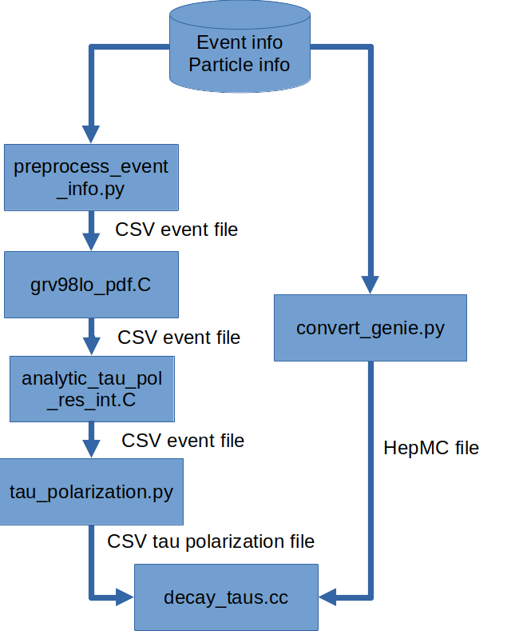
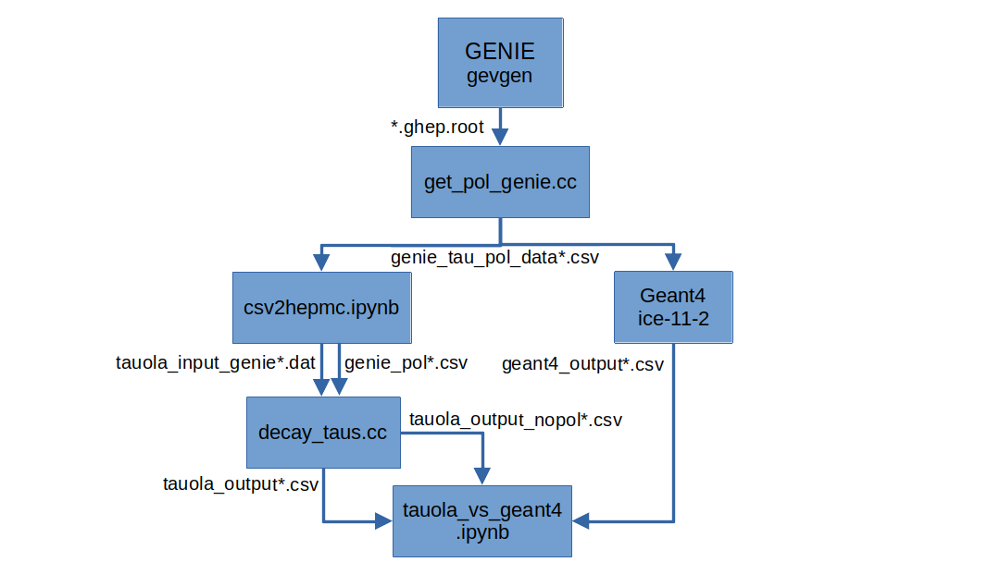

# Compare tau decays between IceCube and Tauola
This folder contains most of the code necessary for generating and analyzing events for tau decays from IceCube and Tauola, where the tau lepton has been created from a tau neutrino interacting with ice. The code is written in C++ and Python.

## Workflow for decaying IceCube events with Tauola
Some of the programs in this directory are used to calculate the tau polarization of IceCube events, and then simulate decays with Tauola. The programs used to run this workflow is explained below:



All of these steps do not have to be executed manually. Instead, one can run [decay_taus.sh](./decay_taus.sh), which runs all of these programs sequentially. The only thing that needs to be changed is the [tauola_settings.yaml](./tauola_settings.yaml), which contains all settings for the programs. The parameters are described below:

| Parameter | Type | Description |
| --- | --- | --- |
| start_step | int (1-6) | Step to start from. All steps before this will be skipped. |
| energy | list of ints | Energy of the incoming neutrino in GeV. |

The energies are iterated over and used to select the correct file name.
The list should be in the format 
```yaml
energy:
  - 1
  - 2
  - 3
```
where each energy is on a new line and there is a space (" ") between the dash ("-") and the energy value. Note that I do not use a proper YAML parser, so the format must be correct.

## Only calculating the tau polarization
This section goes a bit more in-depth into the tau polarization calculation, which is one of the steps that are performed when running decay_taus.sh.

The tau polarization is calculated by the program [tau_polarization.py](./tau_polarization.py). This program reads CSV files with information about the incoming tau neutrino, the produced tau lepton, and the nucleus as input, and outputs a CSV file with the tau polarization for each produced tau lepton.

The tau polarization calculation code further relies on the output of two other programs (written in C++), which calculate parameters for resonance and DIS interactions that are used in the tau polarization calculation. These programs are [preprocess_event_info.py](./preprocess_event_info.py), [analytic_tau_pol_dis_int.C](./analytic_tau_pol_dis_int.C) and [analytic_tau_pol_res_int.C](./analytic_tau_pol_res_int.C). These are explained in detail below.

### File structure
The input data is separated into event information and particle information. 

The event information contains information relevant to the full event, e.g. the event number, whether it was a DIS, QEL or RES interactions, which quark inside the nucleon was hit (only for DIS) etc. More information about these columns can be found in the GENIE physics manual, under the section about the gst format.

The particle information lists all particles that are produced that are part of the interaction (incoming neutrino, incoming nucleus, outgoing tau lepton, etc.). Information about the incoming neutrino and nucleus, as well as the tau lepton are used to calculate the tau polarization, hence why this file is also needed.

### Preprocess event information
The program [preprocess_event_info.py](./preprocess_event_info.py) reads a CSV file with event information, and adds columns about the nucleus and the rescaled Björken x.
These parameters are later used to calculate the polarization for RES and DIS events. The output is a new CSV file with the added columns.

Here is an example of how to run the program:
```bash
python preprocess_event_info.py -ie test_genie_NuTau_100.0_GeV_event_info.csv -ip test_genie_NuTau_100.0_GeV_particles.csv  -o ../data/test_genie_NuTau_100.0_GeV_event_info_dis.csv
```
### Calculate form factors for DIS events
To calculate the tau polarization for DIS events, the form factors $F_1$ to $F_5$ are needed. These are calculated by the program [analytic_tau_pol_dis_int.C](./analytic_tau_pol_dis_int.C). The reason for this is that the code for calculating the form factors is already implemented in the GENIE library. [analytic_tau_pol_dis_int.C](./analytic_tau_pol_dis_int.C) is therefore a thin wrapper around GENIE.
```bash
                                           # Input CSV file with event information           # Output CSV file with the added form factors        Use the hit quark information or not (default is false)
genie -l -b -q "analytic_tau_pol_dis_int.C(\"test_genie_NuTau_100.0_GeV_event_info_dis.csv\",\"../data/test_genie_NuTau_100.0_GeV_event_info_f.csv\",false)"
```
The most accurate way of calculating the form factors would be to use the hit quark information. However, this can sometimes give unphysical values for the polarization. Tom Stuttard managed to solve this, so please contact him regarding this.

### Calculate $\Sigma$ values for RES events
GENIE is once again used for resonance scattering, where the $\Sigma$ values are calculated. The $\Sigma$ values are roughly the values in the polarization density matrix.
The program takes the event information CSV file as input, and outputs a new CSV file with the added `sigpp` ($\Sigma^{++}$), `sigm` ($\Sigma^{--}$) and `sigmp` $\Sigma^{+-}$ columns (in the Standard Model, $\Sigma^{+-} = \Sigma^{-+}$).

Some modifications to the GENIE source code was necessary to get this to work, as the $\Sigma$ values are kind of calculated but not accessible via their public API. The modified GENIE source code can be found in [BSKLNBaseRESPXSec2014.cxx](./BSKLNBaseRESPXSec2014.cxx) and [BSKLNBaseRESPXSec2014.h](./BSKLNBaseRESPXSec2014.h), with comments marking the changes.

The code can be executed as follows:
```bash
                                            # Input CSV file with event information           # Output CSV file with the added Sigma values
genie -l -b -q "analytic_tau_pol_res_int.C(\"test_genie_NuTau_100.0_GeV_event_info_f.csv\",\"test_genie_NuTau_${energy}.0_GeV_event_info_sig.csv\")"
```

### Calculate the tau polarization
Lastly, the tau polarization is calculated by the program [tau_polarization.py](./tau_polarization.py). This program reads the CSV files with the event information, the form factors (for DIS), $\Sigma$ values (for RES), and the full particle information (4-momentum of the incoming neutrino, incoming nucleus, outgoing tau lepton) are used calculates the tau polarization for each event. The output is a new CSV file with the tau polarization for each tau particle.

The program can be executed as follows:
```bash
python tau_polarization.py -ip test_genie_NuTau_100.0_GeV_particles.csv -ie test_genie_NuTau_100.0_GeV_event_info_sig.csv -o NuTau_100.0_GeV_tau.csv
```
The output is the `NuTau_100.0_GeV_tau.csv` file in this case, which contains the tau polarization for each tau lepton produced in the event, as well as the event number.
This can then be used as an input to Tauola. The polarization vector is given in the lab frame (which must be specified when running Tauola).

## Workflow for generating GENIE events
Some of the programs in this directory are used to generate events with GENIE, and then simulate decays with Tauola and Geant4. This is used for testing purposes, as I then have all information from GENIE available, which can be compared to my runs when only using the CSV file information from the I3 files. The programs used to run this workflow is explained below:



The arrows show the data flow and the file names of the input/output files.

All of these steps do not have to be executed manually. Instead, one can run `generate_events.sh`, which runs all of these programs sequentially. The only thing that needs to be changed is the settings.yaml, which contains all settings for the programs. The parameters are described below:
<!-- A table with 3 columns, one with the parameter name, one with the type, and one for the description -->
| Parameter | Type | Description |
| --- | --- | --- |
| energy | int/float | Energy of the neutrino in GeV |
| genie_n_events | int | Number of events to generate with GENIE |
| run | int | Run number of the GENIE events. Included in the GENIE output file name. |
| pdg | int | PDG code of the neutrino. Either 16 or -16 |
| start_step | int (1-5) | Step to start from. All steps before this will be skipped. |
| tau_n_events | int | Number of events to generate with Tauola. This will be calculated automatically by a program that counts the number of GENIE events that produced a tau lepton, and should therefore usually not be changed by the user. |

The start step values correspond to these parts of the workflow:
Indicates which process to start from. 
1. from beginning.
2. skip GENIE.
3. skip conversion from root to csv.
4. skip conversion from csv to HepMC file and tau csv file generation.
5. skip Tauola simulations.
