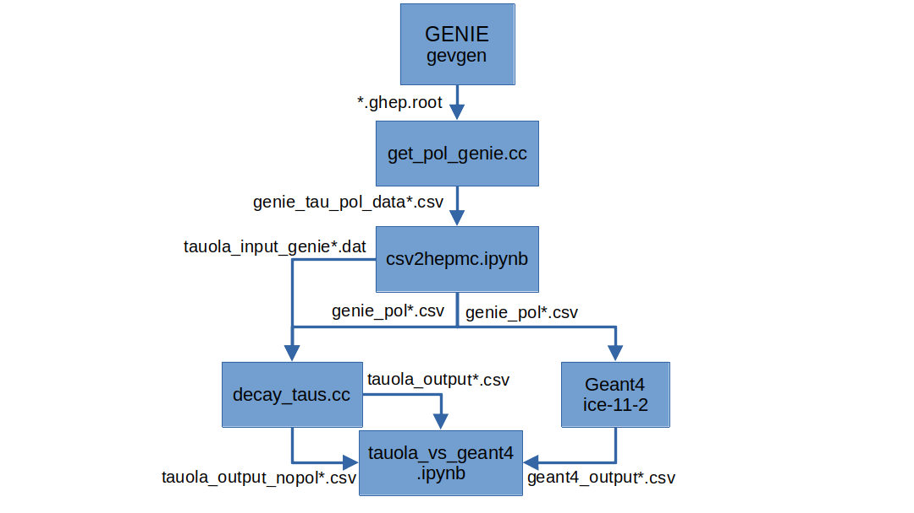

# Compare tau decays between IceCube and Tauola
This folder contains most of the code necessary for generating and analyzing events for tau decays from IceCube and Tauola, where the tau lepton has been created from a tau neutrino interacting with ice. The code is written in C++ and Python.

## Workflow for decaying IceCube events with Tauola
Some of the programs in this directory are used to calculate the tau polarization of IceCube events, and then simulate decays with Tauola. The programs used to run this workflow is explained below:


All of these steps do not have to be executed manually. Instead, one can run [decay_taus.sh](./decay_taus.sh), which runs all of these programs sequentially. The only thing that needs to be changed is the [tauola_settings.yaml](./tauola_settings.yaml), which contains all settings for the programs. The parameters are described below:

| Parameter | Type | Description |
| --- | --- | --- |
| start_step | int (1-6) | Step to start from. All steps before this will be skipped. |
| energy | list of ints | Energy of the incoming neutrino in GeV. |

The energies are iterated over and used to select the correct file name.
The list should be in the format 
```yaml
energy:
  - 1
  - 2
  - 3
```
where each energy is on a new line and there is a space (" ") between the dash ("-") and the energy value. Note that I do not use a proper YAML parser, so the format must be correct.

## Workflow for local GENIE events
Some of the programs in this directory are used to generate events with GENIE, and then simulate decays with Tauola and Geant4. This is used for testing purposes, as I then have all information from GENIE available, which can be compared to my runs when only using the CSV file information from the I3 files. The programs used to run this workflow is explained below:



The arrows show the data flow and the file names of the input/output files.

All of these steps do not have to be executed manually. Instead, one can run `generate_events.sh`, which runs all of these programs sequentially. The only thing that needs to be changed is the settings.yaml, which contains all settings for the programs. The parameters are described below:
<!-- A table with 3 columns, one with the parameter name, one with the type, and one for the description -->
| Parameter | Type | Description |
| --- | --- | --- |
| energy | int/float | Energy of the neutrino in GeV |
| genie_n_events | int | Number of events to generate with GENIE |
| run | int | Run number of the GENIE events. Included in the GENIE output file name. |
| pdg | int | PDG code of the neutrino. Either 16 or -16 |
| start_step | int (1-5) | Step to start from. All steps before this will be skipped. |
| tau_n_events | int | Number of events to generate with Tauola. This will be calculated automatically by a program that counts the number of GENIE events that produced a tau lepton, and should therefore usually not be changed by the user. |

The start step values correspond to these parts of the workflow:
Indicates which process to start from. 
1. from beginning.
2. skip GENIE.
3. skip conversion from root to csv.
4. skip conversion from csv to HepMC file and tau csv file generation.
5. skip Tauola simulations.